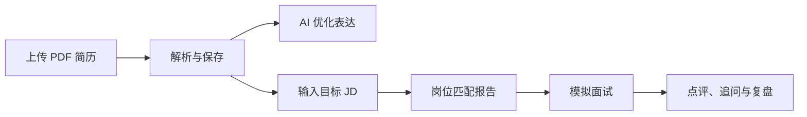
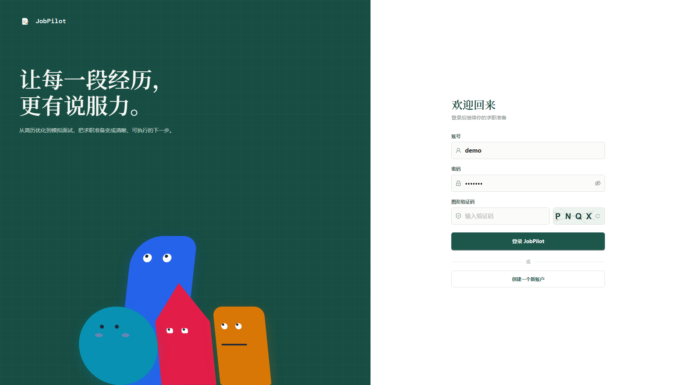

<p align="center">
  
</p>

<h1 align="center">JobPilot</h1>

<p align="center">面向真实求职流程的 AI 简历优化与模拟面试助手</p>

<p align="center">
  <a href="http://dvesiz.qzz.io/"><strong>在线体验 → http://dvesiz.qzz.io/</strong></a>
</p>

<p align="center">
  
  
  
  
</p>

## 为什么是 JobPilot

JobPilot 不把 AI 当作一段泛泛的聊天文本，而是围绕求职者真实工作流设计：上传简历、选择目标岗位、分析匹配缺口、围绕项目经历进行模拟面试，再将每一次回答沉淀为可复盘记录。

## 核心能力

| 模块 | 能力 |
| --- | --- |
| 简历工作区 | PDF 上传、文本解析、本地预览、历史版本切换、AI 优化表达 |
| 岗位匹配 | 基于 JD 的匹配评分、已匹配能力、待补强能力、结构化准备建议 |
| 模拟面试 | 基于简历和 JD 出题、流式点评、连续追问、参考回答 |
| 面试复盘 | 历史记录、点评回看、文本导出 |
| 模型设置 | OpenAI、DeepSeek、ModelScope、SiliconFlow 和自定义 OpenAI-compatible 服务 |
| 账户与安全 | 注册、BCrypt 密码、JWT 鉴权、加密保存用户模型密钥 |

## 产品流程



## 界面演示



## 本地运行

### 前置条件

- Node.js 20+
- Java 17+
- Maven 3.9+

### 启动后端

```bash
cd backend
mvn spring-boot:run
```

后端默认使用文件型 H2 数据库，数据保存在 `backend/data/`，不需要额外安装 MySQL。

### 启动前端

```bash
cd frontend
npm install
npm run dev
```

打开 [http://127.0.0.1:5173](http://127.0.0.1:5173)。

## 配置 AI 模型

登录后进入“账户设置 -> AI 模型”：

1. 选择服务预设，或点击“自定义”输入兼容 OpenAI Chat Completions 的请求根地址。
2. 输入 API Key。
3. 点击“获取模型列表”。
4. 从返回的模型列表中选择目标模型。
5. 保存配置。

支持的根地址示例：

```text
https://api.openai.com/v1
https://api.deepseek.com
https://api-inference.modelscope.cn/v1
https://api.siliconflow.cn/v1
```

服务端会自动补齐 `/chat/completions`。用户 API Key 使用 AES-GCM 加密保存，接口不会返回密钥明文。

## 测试与构建

```bash
# 后端
cd backend
mvn test

# 前端
cd frontend
npm run build
```

## 容器部署

项目包含 `docker-compose.yml`、前后端 Dockerfile 和 Nginx 配置。安装 Docker 后执行：

```bash
docker compose up --build
```

默认访问地址为 `http://localhost`。

### 低配置 VPS 部署

对于 2GB 以下内存的服务器，推荐在本地完成构建，再上传运行时文件，避免服务器构建时内存不足：

```bash
# 本地构建
cd backend && mvn package -DskipTests
cd ../frontend && npm run build

# 服务器目录结构
/opt/jobpilot/
  docker-compose.yml
  runtime/
    .env
    backend/app.jar
    backend/data/
    frontend/dist/
    frontend/nginx.conf
```

仓库内的 `deploy/docker-compose.runtime.yml` 是该模式的 Compose 配置。将其复制为服务器 `/opt/jobpilot/docker-compose.yml`，根据 `deploy/runtime.env.example` 创建 `runtime/.env` 后执行：

```bash
docker compose up -d
```

## 安全说明

- 不提交数据库、构建产物、依赖目录和 `.env` 文件。
- AI API Key 仅在服务端加密存储。
- 所有简历、匹配报告和面试记录按用户 ID 隔离。

## 技术栈

- 前端：React、TypeScript、Vite、Ant Design、Axios
- 后端：Spring Boot、Java 17、JDBC、JWT、PDFBox、SSE
- 数据与部署：H2 / MySQL、Redis 限流、Docker、Nginx
